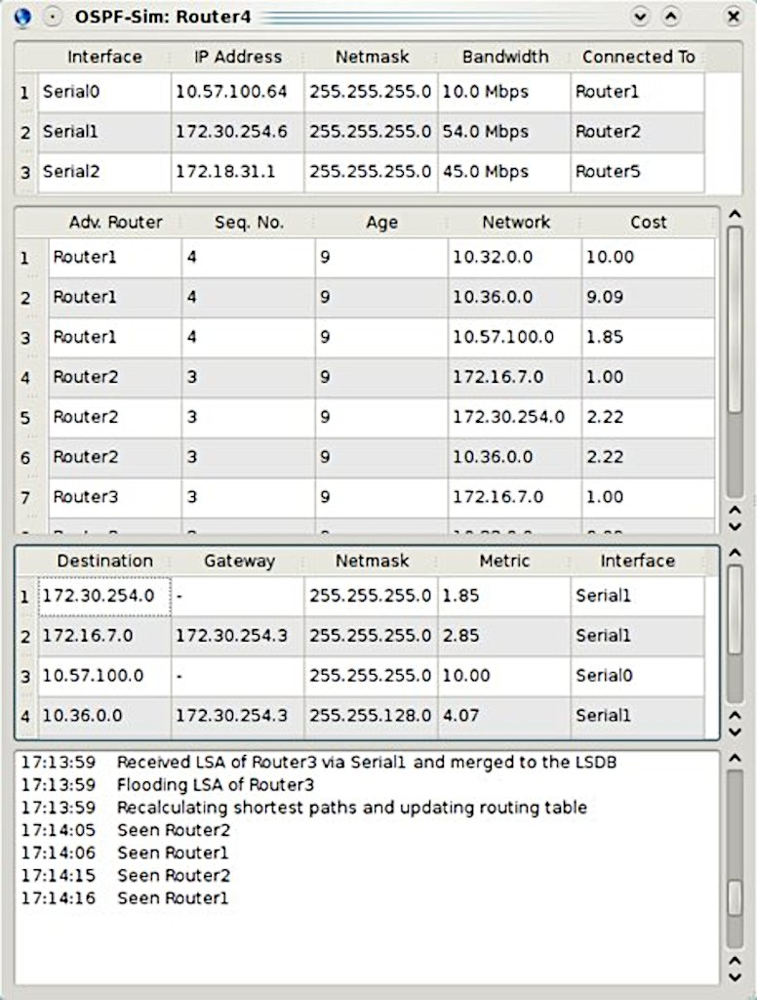

# OSPF Intra-domain Routing Simulation



An implementation of a _subset_ of the OSPF routing protocol using Python. Every instance of the Python program will act as a _standalone router_ and will communicate with each other like real routers, as far as routing table updates are concerned. The _routers_ will send advertisements to each other using the OSPF routing protocol. Each instance of the program will show its routing table in _real-time_.

The OSPF implementation forgoes some of the complexities of the original specifications.

As part of the simulation, link failures will be triggered randomly across the network to be able to observe the behavior of RIP when such events occur.

## Dependencies
1. [Python](http://www.python.org/download/) >= 2.5
2. [PyQt](http://www.riverbankcomputing.com/software/pyqt/download) >= 4.4 

## Tested Platforms
* Linux
* Windows

## Simulation Constraints

### Area Type
* All routers are in a single area, Area 0 (backbone)
* No other areas are connected to the backbone

### Network Type
* All links between routers are Point-to-Point
* DR and BDR for each segment need not be elected since the network type is point-to-point

### Router type
* Since the routers are all in Area 0, all routers are backbone routers

### LSA Type
* All transmitted and received LSAs are Router LSAs

### Router IDs
* The Router ID (RID) used is simply the hostname of a router instead of the IP address of a router's interface

### Path Cost
* Based on Cisco's _standard_ metric which is solely based on a link's bandwidth
* cost = 10<sup>8</sup> bps / bandwidth in bps
* Specified bandwidth for each interface is for the uplink (outgoing direction) only

## Program Design

### Architecture

The simulator simulates a single router running OSPF, not the whole network of routers. Because of this design decision, the user would be able to readily see how OSPF deals with changes in the network.

Since each router would be a standalone application and would be independent from the other routers' processes, there should be a way of communication between them. The peer-to-peer model is the natural choice for communication because of the distributed nature of OSPF.

One implication of using the peer-to-peer model is that the OSPF network type will be restricted to point-to-point links.

### OSPF Architectural Constants

Most of the essential architectural constants of OSPF have been taken into account. This includes the Hello and Dead intervals, Age interval, LS Refresh time, and Max Age. Since the Age interval, LS Refresh time, and Max Age are in the minute-to-hour range, a time scaling factor was introduced. However, the Hello and Dead intervals were not scaled anymore because both of them are only under a minute. The scaling factor, which can be easily changed, defaults to 20 so that 1 minute (60 seconds) would only be 3 seconds in actuality.

### Programming Language and Application Framework

Python's asyncore framework provides the basic infrastructure for writing asynchronous socket service clients and servers.

The Python bindings for Qt, PyQt, is used for implementing the graphical UI. The application's graphical UI is decoupled from the underlying router process. This means that a different UI can be implemented easily. 

### Router Communications

Actual TCP sockets are used. This means that the routers can run in different machines and would still be able to communicate. Each router's interface is implemented as a socket listening at a specified port. The router interfaces are essentially the Servers. Router interfaces are also Clients in the sense that for each packet transmission, an interface sets up a socket dedicated for data transmission to connect to the listening Server (interface) of a directly connected router. Python objects are serialized prior to transmission and deserialized after being completely reassembled at the remote end.

### Router Configuration

The program code need not be changed for each simulated router. The information needed to simulate a router is separately stored in a router configuration file. The configuration file specifies the router's hostname, physical interfaces and their address, netmask, and uplink bandwidth, and the physical connections to other routers. One can simulate any network topology by carefully assigning the correct interconnections between routers.

```
[Local]
hostname = Router1

[Local:Serial0]
address = 10.36.2.100
netmask = 255.255.128.0
bandwidth = 54000000
port = 1025
link = Router2

[Router2]
host = localhost
port = 2000
```

_Sample configuration for a router with a single interface (Serial0, 54 Mbps uplink, 10.36.2.100/17) connected to Router2 simulated in the same machine (localhost, port 2000)_
